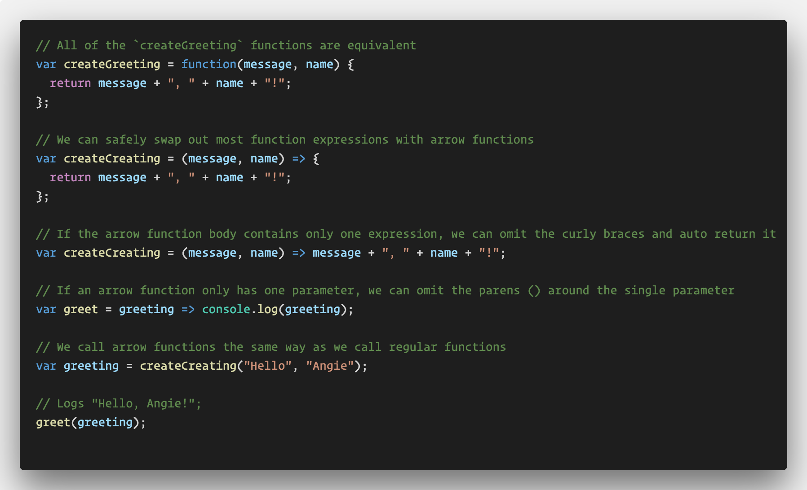
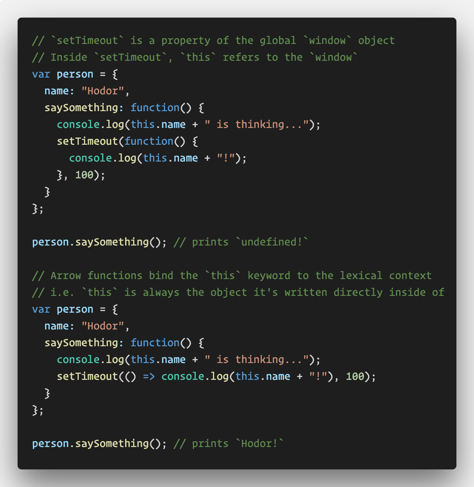
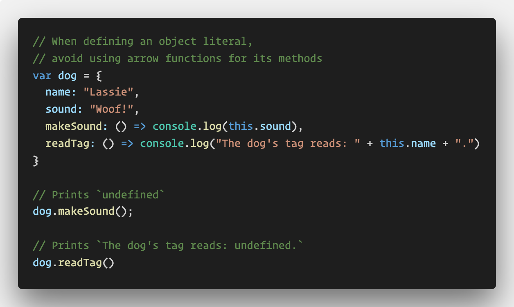

# Arrow Functions

In this demonstration we will give students and overview of arrow functions, including syntax differences, when to use them, and when to avoid them.

* Explain to the class that ES6 introduces a newer shorter syntax for writing functions. Consider the following example found in [01-syntax.js](01-syntax.js).

  

  * Point out how we can swap out a function expression for the shorter arrow function syntax.

  * Bring everyone's attention to how we can optionally shorten this syntax even further by removing the curly braces if the function has only one expression inside of its body. Explain that when we do this the single expression is returned automatically.

  * Finally point out that if an arrow function takes a single parameter, we can optionally omit the parentheses around that parameter.

* Take a few moments to answer any questions about the arrow function syntax before moving on to some behavioral differences between arrow functions and regular functions.

* Now walk through the first part of the code in [02-context.js](02-context.js). 

  

  * Students may still not feel completely comfortable with the `this` keyword in JavaScript yet, inform them that many experienced developers still aren't as it's a tricky topic.

  * But remind them that generally if a function is a method, or property of an object, `this` inside of it refers to the object it's attached to. But if the function isn't a property of the object, it will refer to the window or global object.

  * For this reason, `this` inside of the `setTimeout` method refers to the window. After all, it is a property of the window object, i.e. `window.setTimeout`.

  * Explain that we could resolve this issue by using `.bind(this)` as we've done before, but ES6 introduces arrow functions, a shorter more concise syntax for doing just this.

  * Arrow functions bind `this` to the lexical scope, e.g. the object it's written inside of as we read it.

  * Point out how this code works as intended. Explain that this is because an arrow function automatically binds to the context or object it's written inside of, even if it is not a direct property of that object.

  * Explain that this may seem great, but we can experience unexpected results if we were to write an object's method as an arrow function. Demonstrate [03-arrow-property-methods.js](03-arrow-property-methods.js).

    

    * Explain that when we define an object literal, we want to avoid using arrow functions for its methods. In these cases, the arrow function will bind to the context the object literal belongs to (probably the window or global object).

    * Explain that we can replace regular functions for arrow functions _most_ of the time, but they aren't meant to replace regular functions entirely for reasons like this. Additionally arrow functions can't be used as constructor functions and also don't have access to Function prototype methods such as `bind`, `call`, and `apply`.

* Explain that students will become more comfortable with when to use and not use arrow functions as they practice using them. For now, they should understand that we can use them most of the time, but should avoid using them as object methods.

* Take a moment to answer any lingering questions.